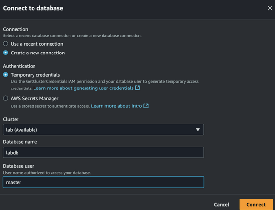

# Redshift_Music_Analysis

## 1. Introduction

This repository contains a dataset representing user preferences across various entertainment categories, such as music genres, sports, and theater. The dataset can be used to run queries, analyze trends, and create personalized recommendation systems.

## 2. Data Dictionary

| Header         | Description                                                   |
|----------------|---------------------------------------------------------------|
| userid         | Unique identifier for each user                               |
| username       | System-generated unique username                              |
| firstname      | User's first name                                              |
| lastname       | User's last name                                               |
| city           | City where the user resides                                    |
| state          | U.S. state abbreviation where the user lives                  |
| email          | User's email address                                           |
| phone          | User's phone number                                            |
| likesports     | Indicates whether the user likes sports (true/false)          |
| liketheatre    | Indicates whether the user likes theatre (true/false)         |
| likeconcerts   | Indicates whether the user likes concerts (true/false)        |
| likejazz       | Indicates whether the user likes jazz music (true/false)      |
| likeclassical  | Indicates whether the user likes classical music (true/false) |
| likeopera      | Indicates whether the user likes opera (true/false)           |
| likerock       | Indicates whether the user likes rock music (true/false)      |
| likevegas      | Indicates whether the user likes Las Vegas (true/false)       |
| likebroadway   | Indicates whether the user likes Broadway shows (true/false)  |
| likemusicals   | Indicates whether the user likes musicals (true/false)        |

## 3. Data Source

- **s3 location**: can be found under the Source section below
- **delimiter**: `/`

## 4. Launching Redshift Cluster

To launch an Amazon Redshift cluster, follow these steps:
1. Go to the AWS Management Console.
2. Navigate to Redshift and select **Create Cluster**.
3. Configure your cluster (e.g., node type, database name, master username/password).
4. Launch the cluster and wait for it to become available.

I used 2 nodes of dc2.large type cluster.

## 5. Creating SQL Client

Redshift→ Query Editor→Connect to DB→




## 6. Queries

Start by defining a schema: first, run a query to create the table, 

```sql
CREATE TABLE users (
  userid INTEGER NOT NULL,
  username CHAR(8),
  firstname VARCHAR(30),
  lastname VARCHAR(30),
  city VARCHAR(30),
  state CHAR(2),
  email VARCHAR(100),
  phone CHAR(14),
  likesports BOOLEAN,
  liketheatre BOOLEAN,
  likeconcerts BOOLEAN,
  likejazz BOOLEAN,
  likeclassical BOOLEAN,
  likeopera BOOLEAN,
  likerock BOOLEAN,
  likevegas BOOLEAN,
  likebroadway BOOLEAN,
  likemusicals BOOLEAN
);
```

then load the data using the command below.

```sql
COPY users FROM 's3://awssampledbuswest2/tickit/allusers_pipe.txt'
CREDENTIALS 'aws_iam_role=<your_IAM_arn>'
DELIMITER '|';
```

### 6.1. Total Count of Users

```sql
select count(*) from users;
```

### 6.2. Users from Ohio who enjoy sports but are not fans of opera. Sorting the output by their first names.

```sql
select * from users where state = 'OH' and NOT likeopera and likesports order by firstname;
```

### 6.3. The top 10 cities with the highest number of jazz music fans.

```sql
select city, count(*) from users where likejazz group by city order by 2 DESC limit 10;
```

### 6.4. First and last names of users whose last name is Smith and who enjoy both theatre and classical music.

```sql
select firstname, lastname from users where liketheatre and likeclassical and LOWER(lastname) = 'smith';
```

## 7. Source

- **Dataset**: s3://awssampledbuswest2/tickit/allusers_pipe.txt Note: You need to have an IAM access from AWS in order to achieve it.
- **Resource**: Introduction to Amazon Redshift, AWS (2025). https://explore.skillbuilder.aws/learn/course/internal/view/elearning/896/introduction-to-amazon-redshift
